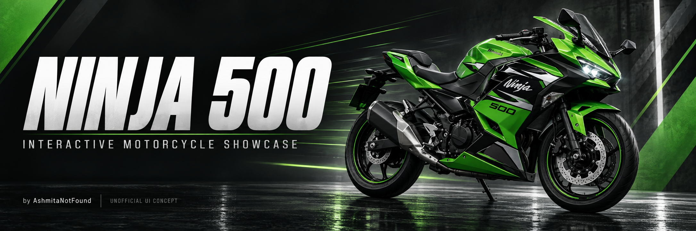

<p align="center">
  
</p>

<h1 align="center">🏍️ NINJA 500</h1>

<p align="center">
  <strong>An interactive motorcycle showcase, designed in Figma and brought to life with motion.</strong>
</p>

<p align="center">
  
  
  
  
</p>

<p align="center">
  Created by <a href="https://github.com/AshmitaNotFound"><strong>AshmitaNotFound</strong></a>
  <br>
  Website implementation assisted by OpenAI Codex
</p>

---

## ✨ About the Project

I created the original Ninja 500 interface in **Figma** to practice product presentation, typography, color, and visual hierarchy.

The main experience lets visitors select a motorcycle color, watch a driving-inspired transition, and open an animated product-details panel.

> **Unofficial student UI concept. Not affiliated with or endorsed by Kawasaki.**

## 🎬 Explore the Interactions

<details open>
<summary><strong>🏍️ Motorcycle color transitions</strong></summary>

<br>

Choose between **Green**, **Silver**, and **Black**.

1. The current motorcycle dips slightly before accelerating out of view.
2. Tilt and motion blur create a sense of speed.
3. The selected motorcycle enters from the left.
4. It decelerates and settles into position.

Rapid clicks queue the latest color selection until the current transition finishes.

The animation uses the **JavaScript Web Animations API**. It simulates driving with flat PNG images; the wheels are not animated independently.

</details>

<details>
<summary><strong>🔍 Explore More — animated details panel</strong></summary>

<br>

Click **Explore More** to open a panel featuring:

- The selected motorcycle image.
- Its selected color.
- The price from the original design.
- Engine, styling, and riding-position information.

The panel slides into view over a dimmed background.

Close it using **×**, **Back to the Bike**, or the **Escape key**.

</details>

<details>
<summary><strong>📱 Responsive layout and accessibility</strong></summary>

<br>

- Layout adjustments for smaller screens.
- Keyboard-accessible color controls.
- Visible focus indicators.
- Clear selected-color states.
- Support for the device’s reduced-motion preference.

</details>

---

## 🎨 Design Elements

<details>
<summary><strong>View the visual design choices</strong></summary>

<br>

| Element | Choice |
| --- | --- |
| Headings and labels | Teko |
| Pricing typography | Tektur |
| Color themes | Green, charcoal, and silver |
| Main imagery | Supplied transparent motorcycle PNGs |
| Product information | Model name, price, and featured characteristics |
| Main controls | Color selection and Explore More |
| Design tool | Figma |

The layout keeps the motorcycle as the main focus while placing product information and controls alongside it.

</details>

## 🛠️ Tools and Technologies

<details>
<summary><strong>View the technology stack</strong></summary>

<br>

| Tool | Purpose |
| --- | --- |
| Figma | Original interface design and asset exports |
| HTML | Page structure and details dialog |
| CSS | Styling, responsive layout, and panel transitions |
| JavaScript | Color selection and animation sequencing |
| Web Animations API | Motorcycle acceleration and arrival effects |
| OpenAI Codex | AI-assisted website implementation |
| GitHub | Source-code storage |
| GitHub Pages | Optional static website hosting |

No framework, installation, build step, or API key is required.

Website fonts and motorcycle images are included locally. README badges are loaded from Shields.io.

</details>

---

## 🚀 Run Locally

<details>
<summary><strong>Click for setup instructions</strong></summary>

<br>

1. Download and extract the project.
2. Open **index.html** in a modern browser.
3. Keep the **assets** folder beside the HTML, CSS, and JavaScript files.
4. Select a motorcycle color.
5. Click **Explore More** to view the animated details panel.

</details>

## 🌐 GitHub Pages

<details>
<summary><strong>View publishing instructions</strong></summary>

<br>

After confirming you have permission to publish the included assets:

1. Upload the project files to your GitHub repository.
2. Keep **index.html** at the repository root.
3. Open **Settings → Pages**.
4. Choose **Deploy from a branch**.
5. Select **main** and **/(root)**.
6. Click **Save**.
7. Wait for GitHub to display the website URL.

[Official GitHub Pages instructions](https://docs.github.com/en/pages/getting-started-with-github-pages/configuring-a-publishing-source-for-your-github-pages-site)

</details>

## 📁 Project Structure

<details>
<summary><strong>View the files</strong></summary>

<br>

```text
├── index.html
├── style.css
├── app.js
├── ninja-banner.png
├── assets/
│   ├── Motorcycle images
│   ├── Reference screenshots
│   ├── Local font files
│   └── Font license notices
├── README.md
├── LICENSE
└── THIRD_PARTY_NOTICES.md
```

</details>

---

## 👩‍💻 My Contribution

**Original Figma design and visual direction:** AshmitaNotFound.

**README banner:** AI-generated artwork created for this project.

**Motorcycle images and Kawasaki branding:** third-party assets, not claimed as my original artwork.

This project explores how motion, color selection, and product-detail transitions can bring a static interface to life.

## 📌 Project Scope

<details>
<summary><strong>Read the prototype limitations</strong></summary>

<br>

This is a portfolio design prototype, **not an official Kawasaki website or an online store**.

- Shop, utility icons, and social icons are visual elements only.
- Motorcycle movement is simulated using flat images.
- Prices and specifications come from the supplied design and are not verified current sales information.
- The banner is illustrative AI-generated artwork, not an official product photograph.

</details>

---

## 📜 License and Usage

**Copyright © 2026 AshmitaNotFound. All rights reserved.**

No permission is granted to copy, modify, distribute, sell, or reuse the original project code, design, or documentation without prior written permission, except as permitted by applicable law or binding platform terms.

This notice applies only to original contributions to the extent protected by applicable law.

For permission requests, contact **AshmitaNotFound** through the contact information available on the [GitHub profile](https://github.com/AshmitaNotFound).

See [LICENSE](LICENSE) for the full notice.

<details>
<summary><strong>Third-party assets and existing permissions</strong></summary>

<br>

- Motorcycle images, reference screenshots, Kawasaki/Ninja branding, and fonts remain subject to their respective owners’ rights and licenses.
- No ownership of third-party assets is claimed.
- Teko and Tektur retain their included **SIL Open Font Licenses**.
- An unofficial-project disclaimer does not grant permission to redistribute third-party images.
- Image permissions must be confirmed before public redistribution.
- Public GitHub repositories remain subject to GitHub’s terms, including viewing and forking rights.
- This notice does not revoke permissions validly granted for copies previously distributed under another license.

See [THIRD_PARTY_NOTICES.md](THIRD_PARTY_NOTICES.md).

</details>

---

<p align="center">
  <strong>Design → Interaction → Motion</strong>
  <br>
  A learning project by
  <a href="https://github.com/AshmitaNotFound">AshmitaNotFound</a>
</p>
