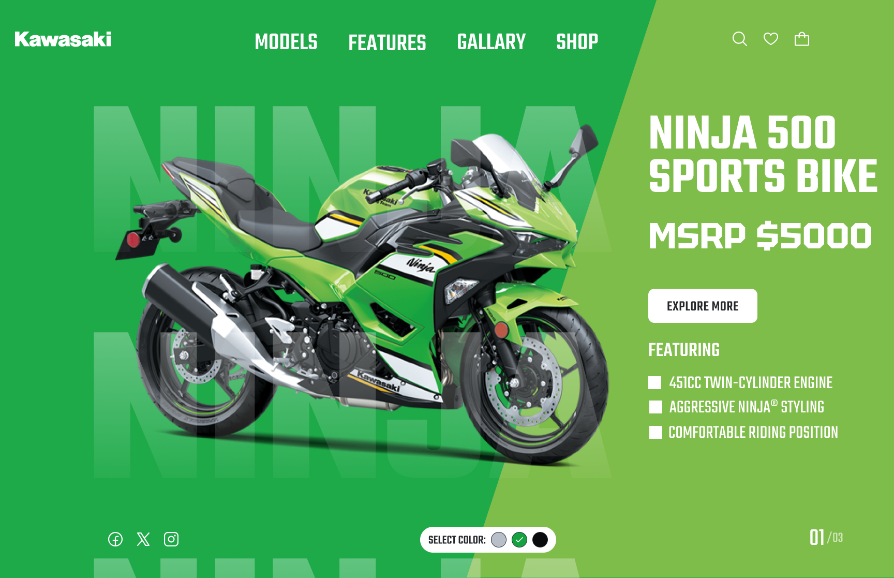

<p align="center">
  
</p>

<h1 align="center">🏍️ NINJA 500</h1>

<p align="center">
  <strong>A Figma concept brought to life through motion.</strong>
</p>

<p align="center">
  
  
  
  
</p>

<p align="center">
  Designed by <a href="https://github.com/AshmitaNotFound"><strong>AshmitaNotFound</strong></a>
  <br>
</p>

---

## 👀 Take a Look



> An unofficial student UI concept—not affiliated with or endorsed by Kawasaki.

## 🎬 Explore the Interactions

<details open>
<summary><strong>🏍️ Bikes that move with your selection</strong></summary>

<br>

Choose **Green**, **Silver**, or **Black**.

1. The current bike dips slightly before accelerating forward.
2. Tilt and motion blur add a sense of speed.
3. The selected bike enters from the left.
4. It decelerates and settles into position.

Built using the **Web Animations API**. Movement is simulated with flat PNG images; the wheels do not rotate independently.

</details>

<details>
<summary><strong>🔍 Explore More — animated details panel</strong></summary>

<br>

Click **Explore More** to reveal:

- The selected bike and its color.
- The price from the original design.
- Engine, styling, and riding-position details.

The panel slides into view with a dimmed background.

Close it using **×**, **Back to the Bike**, or **Escape**.

</details>

<details>
<summary><strong>📱 Responsive layout & accessibility</strong></summary>

<br>

- Layout adjustments for smaller screens.
- Keyboard-accessible color controls.
- Visible focus indicators.
- Clear selected-color states.
- Reduced-motion preference support.

</details>

---

## 🎨 Behind the Design

<details>
<summary><strong>See the design elements</strong></summary>

<br>

| Element | Choice |
| --- | --- |
| Heading and label font | Teko |
| Price font | Tektur |
| Color themes | Green, charcoal, and silver |
| Main visual | Supplied transparent motorcycle images |
| Main interactions | Color selection and Explore More |
| Original design tool | Figma |

I created the original Figma concept to practice product presentation, typography, and visual hierarchy.

</details>

<details>
<summary><strong>See the tools and technologies</strong></summary>

<br>

| Tool | Used for |
| --- | --- |
| Figma | Original UI design and exports |
| HTML | Page structure and details dialog |
| CSS | Styling, responsive layout, and panel motion |
| JavaScript | Color selection and animation sequencing |
| OpenAI Codex | AI-assisted implementation |
| GitHub | Project storage |
| GitHub Pages | Optional website hosting |

No framework, installation, build step, or API key is required.

</details>

---

## 🚀 Try It Locally

<details>
<summary><strong>Click for setup instructions</strong></summary>

<br>

1. Download the project ZIP from GitHub.
2. Extract all files.
3. Open **index.html** in a modern browser.
4. Keep the **assets** folder beside the website files.
5. Select a color and click **Explore More**.

</details>

<details>
<summary><strong>View the project structure</strong></summary>

<br>

```text
├── index.html
├── style.css
├── app.js
├── assets/
│   └── Images, fonts, and font licenses
├── docs/
│   └── banner.svg
├── README.md
├── LICENSE
└── THIRD_PARTY_NOTICES.md
